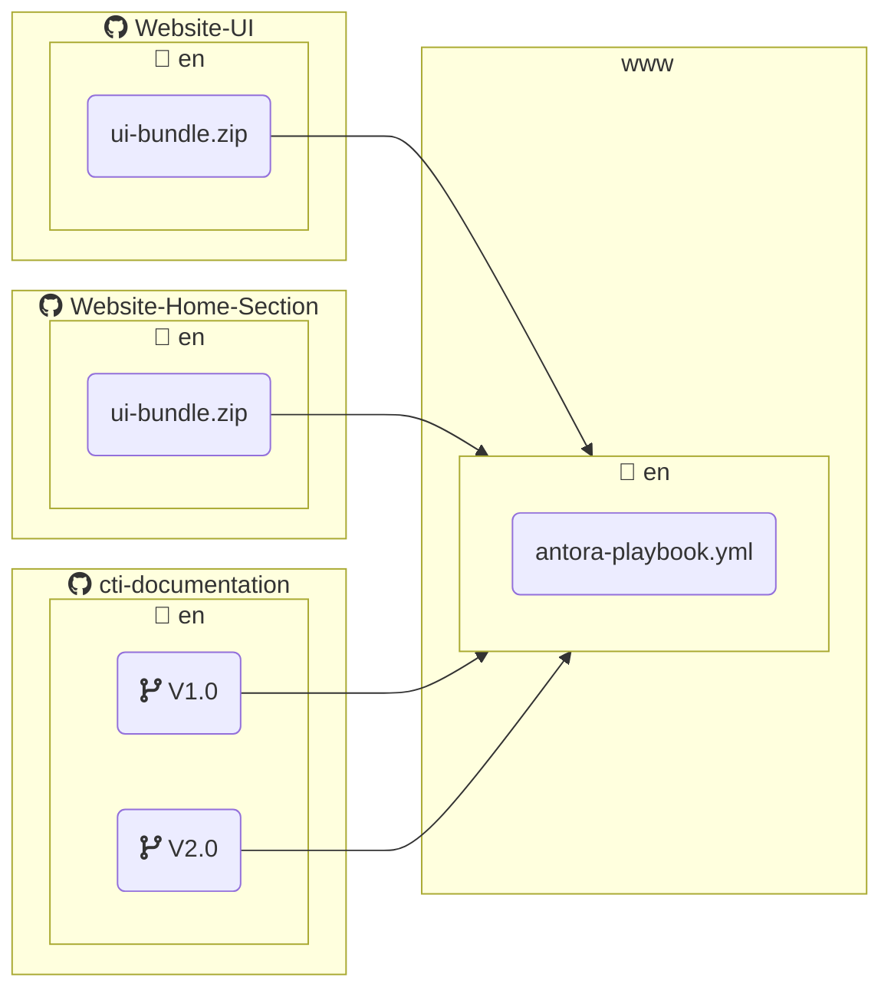

# Website
This repository contains the Antora playbook and the GitHub actions needed to build and publish the website

```mermaid
flowchart LR
    subgraph " <img href='https://github.githubassets.com/favicons/favicon.png'> www"
        subgraph en-www["📂 en"]
            en-antora-playbook(antora-playbook.yml)
        end
    end
    subgraph "<i class="fa-brands fa-github"></i> Website-UI"
        subgraph en-ui["📂 en"]
            en-ui-bundle(ui-bundle.zip)-->en-www
        end
    end
    subgraph "<i class="fa-brands fa-github"></i> Website-Home-Section"
        subgraph en-hs["📂 en"]
            en-hs-content(ui-bundle.zip)-->en-www
        end
        end
    subgraph "<i class="fa-brands fa-github"></i> cti-documentation"
        subgraph en-doc["📂 en"]
            en-conv1(<i class="fas fa-code-branch"></i> V1.0)-->en-www
            en-conv2(<i class="fas fa-code-branch"></i> V2.0)-->en-www
        end
    end
```