# Website
This repository contains the Antora playbook and the GitHub actions needed to build and publish the website

# Structure

The content for each language is constructed from components from multiple repositories.

The diagram below shows how the `en` (English) content is constructed although the process is identical for the `es` (Spanish), `fr` (French), `zh` (Chinese) content with each repository having a 

```mermaid
flowchart LR
    subgraph www["📚 www"]
        en-antora-playbook(antora-playbook-en.yml)
    end
    subgraph website-ui["📚 <a href='https://github.com/LabVIEWCommunityTraining/website-ui'>Website-UI</a>"]
        subgraph en-ui["📂 en"]
            en-ui-bundle(ui-bundle.zip)-->en-antora-playbook
        end
    end
    subgraph website-home["📚 <a href='https://github.com/LabVIEWCommunityTraining/website-home-section'>Website-Home-Section</a>"]
        subgraph en-hs["📂 en"]
            en-hs-content(ui-bundle.zip)-->en-antora-playbook
        end
        end
    subgraph cti-docs["📚 <a href='https://github.com/LabVIEWCommunityTraining/cti-documentation'>cti-documentation</a>"]
        subgraph v1["🌿 V1.0"]
            en-conv1(📂www/en)-->en-antora-playbook
        end
        subgraph v2["🌿 V2.0"]
            en-conv2(📂www/en)-->en-antora-playbook
        end
    end
```

