# Website
This repository contains the Antora playbook and the GitHub actions needed to build and publish the website

## Structure

The content for each language is constructed from components separated across multiple repositories:

* [www](#Website) (this repository) contains the `antora-playbooks` for each language which describe how each language's site should be built and from which components. It also provides some additional `html`, `javascript` and `css` in the `supplemental-ui` directory which override the default content for all the sites.
* [Website-UI](https://github.com/LabVIEWCommunityTraining/website-ui) is used to create an antora `ui-bundle.zip` for each language - this defines the `html`,`css` and `javascript` used for each site
* [Website-Home-Section](https://github.com/LabVIEWCommunityTraining/website-home-section) provides a landing paged for each language and any other non-course related content
* [cti-documentation](https://github.com/LabVIEWCommunityTraining/cti-documentation) contains the course materials with different course-versions stored in different branches

The diagram below visualizes how content from each repository is combined for the `en` (English) language site but the method is the same for the `es` (Spanish), `fr` (French), `zh` (Chinese) sites.

```mermaid
flowchart LR
    subgraph www["📚 www"]
        en-antora-playbook(antora-playbook-en.yml)
    end
    subgraph website-ui["📚 <a href='https://github.com/LabVIEWCommunityTraining/website-ui'>Website-UI</a>"]
        en-ui["📂 en"]-->|🛠️ github-action|en-ui-bundle
        en-ui-bundle["📦 en/ui-bundle.zip"]-->en-antora-playbook
    end
    subgraph website-home["📚 <a href='https://github.com/LabVIEWCommunityTraining/website-home-section'>Website-Home-Section</a>"]
        en-hs["📂 en"]-->en-antora-playbook
    end
    subgraph cti-docs["📚 <a href='https://github.com/LabVIEWCommunityTraining/cti-documentation'>cti-documentation</a>"]
        subgraph v1["🌿 V1.0"]
            en-conv1(📂www/en)-->en-antora-playbook
        end
        subgraph v2["🌿 V2.0"]
            en-conv2(📂www/en)-->en-antora-playbook
        end
    end
    en-output["🌐 www/en"]
    en-antora-playbook-->|🛠️ github-action|en-output
```

(key: 📚 repository, 📂 folder, 🌿 git-branch, 📦 zip-file, 🌐 published-site)